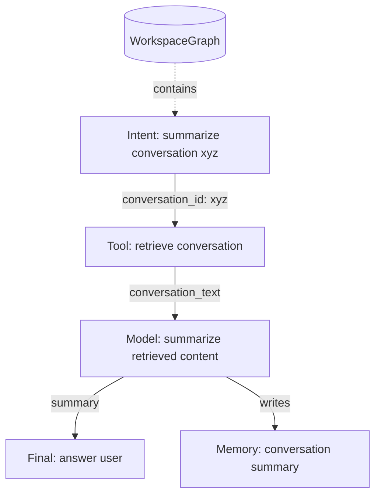
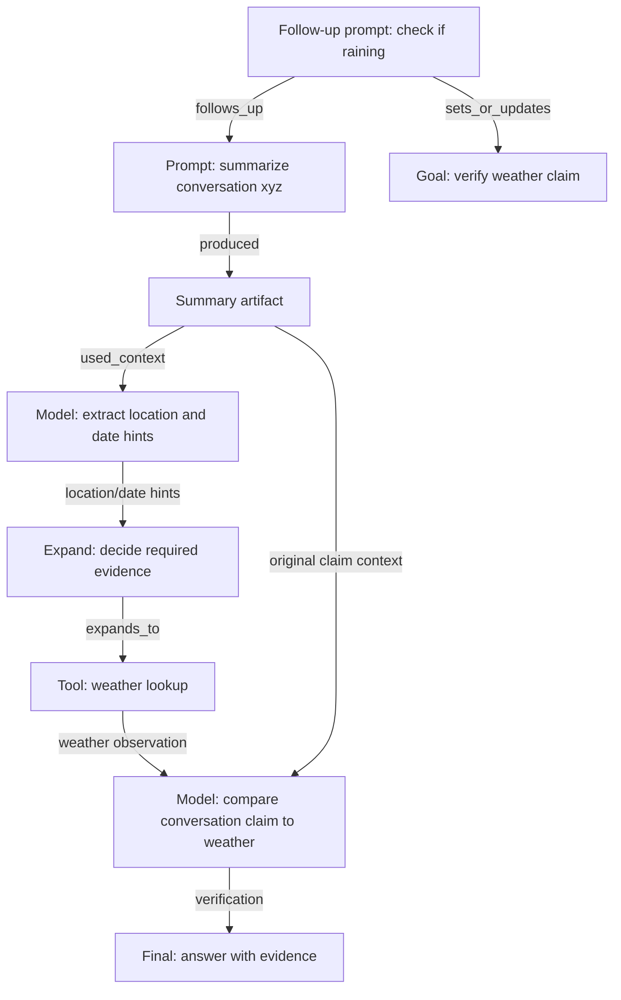

# LLMASM RFC: Local LLM Orchestration With Persistent Graph Memory

Status: Draft

> **Name:** LLMASM — *LLM Assembly Scheduling Machine*. The name reflects the library's assembly-style VM execution model (program counter, typed instructions, checkpoints) and its role as a scheduler over persisted task subgraphs. The domain is `llmasm`.

Audience: library maintainers, early contributors, and users building local-first LLM workflows.

## 1. Summary

LLMASM is a proposed Python library for orchestrating local LLM and tool calls inside a persistent typed graph. A user prompt is not the whole graph. Instead, each prompt creates or extends a bounded task subgraph inside a long-lived workspace graph that keeps growing across prompts, follow-ups, tool calls, model calls, artifacts, memories, and reasoning steps.

The main design goal is context discipline for local LLMs. Instead of passing the full conversation, full history, or full graph to every model call, the runtime selects only the required upstream artifacts, goal-relevant memory, and local neighborhood of the graph for the next node.

The first version should provide:

- A hybrid prompt-to-subgraph compiler.
- A small VM-style executor with a program counter.
- Persistent execution traces in a Postgres-backed workspace graph.
- Ollama-first local LLM support.
- External tool execution for data retrieval.
- Embedding-assisted memory lookup and context selection.
- Runtime graph expansion for ReAct-style reasoning and additional tool calls.

The first version should not attempt full autonomous optimization, agent self-improvement, or DSPy-style program tuning. Those are roadmap items built on top of reliable compilation, execution, and trace persistence.

## 2. Goals And Non-Goals

### Goals

- Compile natural-language tasks into typed executable subgraphs.
- Maintain a long-lived workspace graph across prompts and follow-ups.
- Persist every plan, node execution, tool call, model call, artifact, checkpoint, and final output.
- Keep local LLM prompts small by passing only relevant node inputs.
- Let selected reasoning nodes request new nodes or edges during execution.
- Support local-first execution through Ollama as the required built-in model provider.
- Use Postgres as the persistence foundation.
- Prefer Apache AGE for graph functionality when available.
- Prefer pgvector for embeddings when available.
- Provide a plain Postgres node/edge fallback if graph extensions are unavailable.
- Make execution analysis queryable from persisted metadata.

### Non-Goals For V0

- Distributed execution.
- Hosted model provider parity.
- Fully automatic graph rewriting from past performance.
- End-user visual graph editing.
- Multi-tenant authorization.
- Fine-tuning or training models.
- Replacing application databases that own source data such as conversations, documents, tickets, or messages.

## 3. Design Influences

LLMASM borrows ideas from several existing systems without cloning their API:

- LangGraph: explicit graph execution, stateful workflows, resumable agent flows.
- smolagents: simple tool-oriented agent execution and minimal ceremony.
- DSPy: program-level optimization as a future direction, especially around prompt/module improvement.
- Assembly-style VMs: a program counter, executable instructions, checkpoints, and deterministic step progression.
- GraphRAG systems: graph and vector memory as retrieval layers, not as indiscriminate context dumps.

The central difference is that LLMASM treats graph persistence as part of the runtime contract. The graph is not only a plan for one prompt; it is the durable memory, audit structure, and execution substrate that future prompts can query and extend.

## 4. Core Concepts

### WorkspaceGraph

A `WorkspaceGraph` is the long-lived graph for a project, user, or application scope. It contains task subgraphs, source references, memory, artifacts, run traces, and cross-run relationships. It is expected to grow over time.

Mock shape:

```text
WorkspaceGraph {
  id: "workspace_01J...",
  name: "personal_assistant_memory",
  status: "active",
  created_at: "...",
  metadata: {
    owner_scope: "local_user",
    default_context_budget_tokens: 4096,
    target_provider: "ollama",
    graph_backend: "postgres_age"
  }
}
```

### TaskGraph

A `TaskGraph` is a bounded executable subgraph created from a prompt, follow-up, recurring workflow, or runtime expansion request. It is stored inside a `WorkspaceGraph` and may connect to prior task graphs through memory, artifact, source, topic, or goal edges.

```text
TaskGraph {
  id: "taskgraph_01J...",
  workspace_graph_id: "workspace_01J...",
  root_prompt_node_id: "node_prompt_01J...",
  parent_task_graph_id: "taskgraph_previous_01J...",
  status: "compiled",
  compiler_version: "0.1.0",
  created_at: "...",
  metadata: {
    intent: "summarize_conversation",
    conversation_turn_id: "turn_01J...",
    goal_id: "goal_01J...",
    context_budget_tokens: 4096
  }
}
```

### Run

A `Run` is one execution of a task subgraph. Multiple runs may use the same task subgraph with different inputs, tools, model settings, or memory snapshots. Follow-up prompts usually create new task subgraphs that link back to earlier prompts, goals, artifacts, and memory.

```text
Run {
  id: "run_01J...",
  workspace_graph_id: "workspace_01J...",
  task_graph_id: "taskgraph_01J...",
  status: "running",
  program_counter: "node_retrieve_conversation",
  started_at: "...",
  completed_at: null,
  metadata: {
    user_prompt: "...",
    model: "llama3.1:8b",
    max_context_tokens: 4096
  }
}
```

### Node

A `Node` is an executable or structural step. Nodes should be typed so the executor can validate inputs and outputs before calling tools or models.

Common node kinds:

- `intent`: normalized user goal and extracted task variables.
- `tool`: external function call.
- `model`: LLM inference.
- `memory_query`: retrieval from persisted graph/vector memory.
- `compress`: summarization or structured extraction.
- `router`: deterministic or model-assisted branch selection.
- `expand`: ReAct-style node that proposes additional nodes, edges, or tool calls.
- `goal`: current objective, constraints, and success criteria.
- `observation`: persisted fact discovered by a tool, model, or user follow-up.
- `final`: response assembly.

```text
Node {
  id: "node_summarize",
  workspace_graph_id: "workspace_01J...",
  task_graph_id: "taskgraph_01J...",
  kind: "model",
  name: "summarize_conversation",
  input_schema: "ConversationText",
  output_schema: "Summary",
  execution: {
    provider: "ollama",
    model: "llama3.1:8b",
    prompt_template: "summarize_conversation.v1"
  },
  metadata: {
    max_input_tokens: 3000,
    expected_output_tokens: 500
  }
}
```

Node definitions are static. Runtime status is tracked per run through `RunNodeState`, not on the node itself, so the same task subgraph can be executed more than once without overwriting prior run state.

```text
RunNodeState {
  run_id: "run_01J...",
  node_id: "node_summarize",
  status: "pending",
  attempts: 0,
  last_error: null,
  output_artifact_ids: []
}
```

### Edge

An `Edge` connects a producing node output port to a consuming node input port. The edge is the reason a downstream node can access an upstream artifact.

```text
Edge {
  id: "edge_conversation_to_summary",
  workspace_graph_id: "workspace_01J...",
  task_graph_id: "taskgraph_01J...",
  from_node_id: "node_retrieve_conversation",
  from_port: "conversation",
  to_node_id: "node_summarize",
  to_port: "conversation_text",
  transform: "extract_text",
  required: true
}
```

Edges are not only execution pipes. The workspace graph should also support durable semantic and provenance edges:

- `depends_on`: execution dependency.
- `produced`: node produced artifact.
- `used_context`: model call used artifact or memory item.
- `summarizes`: memory item summarizes source artifact.
- `refers_to`: prompt or observation refers to source data.
- `follows_up`: prompt or task graph follows an earlier prompt/task graph.
- `supports_goal`: node or artifact contributes to the active goal.
- `contradicts`: observation conflicts with a prior memory item or answer.
- `expands_to`: reasoning node injected a new node or subgraph.

### Port

A `Port` gives names and types to node inputs and outputs.

```text
Port {
  node_id: "node_summarize",
  name: "conversation_text",
  direction: "input",
  schema_ref: "ConversationText",
  required: true
}
```

### Artifact

An `Artifact` is persisted output from a node execution. Artifacts are immutable by default. If a node is re-executed, it creates a new artifact version.

```text
Artifact {
  id: "artifact_01J...",
  run_id: "run_01J...",
  node_id: "node_summarize",
  port: "summary",
  content_type: "application/json",
  content_ref: "postgres://artifacts/artifact_01J...",
  token_count: 312,
  created_at: "..."
}
```

### ToolCall

A `ToolCall` records an external function invocation.

```text
ToolCall {
  id: "toolcall_01J...",
  run_id: "run_01J...",
  node_id: "node_retrieve_conversation",
  tool_name: "conversation_store.retrieve",
  input_json: {"conversation_id": "xyz"},
  output_artifact_id: "artifact_01J...",
  status: "succeeded",
  latency_ms: 42
}
```

### ModelCall

A `ModelCall` records an LLM invocation, including the exact selected context.

```text
ModelCall {
  id: "modelcall_01J...",
  run_id: "run_01J...",
  node_id: "node_summarize",
  provider: "ollama",
  model: "llama3.1:8b",
  prompt_artifact_id: "artifact_prompt_01J...",
  output_artifact_id: "artifact_summary_01J...",
  input_tokens: 2580,
  output_tokens: 290,
  status: "succeeded"
}
```

### Embedding

An `Embedding` is attached to artifacts, memory items, prompts, summaries, tool descriptions, or nodes. Embeddings should not replace graph structure; they augment retrieval and ranking.

```text
Embedding {
  id: "embedding_01J...",
  owner_type: "artifact",
  owner_id: "artifact_summary_01J...",
  model: "nomic-embed-text",
  vector: "<pgvector>",
  metadata: {
    text_hash: "...",
    dimensions: 768
  }
}
```

### MemoryItem

A `MemoryItem` is reusable persisted knowledge derived from previous runs. It may point back to artifacts and nodes so provenance remains queryable.

```text
MemoryItem {
  id: "memory_01J...",
  kind: "conversation_summary",
  text: "Conversation xyz discussed project scope, graph persistence, and local Ollama execution.",
  source_artifact_id: "artifact_summary_01J...",
  source_run_id: "run_01J...",
  confidence: 0.86,
  created_at: "..."
}
```

### Checkpoint

A `Checkpoint` captures execution state after each step or before risky operations.

```text
Checkpoint {
  id: "checkpoint_01J...",
  run_id: "run_01J...",
  program_counter: "node_summarize",
  completed_node_ids: ["node_intent", "node_retrieve_conversation"],
  failed_node_ids: [],
  state_hash: "...",
  created_at: "..."
}
```

## 5. Example: Prompt Subgraphs And Follow-Ups

Initial prompt:

```text
retrieve the conversation xyz and give me a summary of the content
```

Compiled task subgraph:



Mock compiled nodes:

```text
node_intent:
  kind: intent
  output:
    task = "summarize_conversation"
    conversation_id = "xyz"

node_retrieve_conversation:
  kind: tool
  tool = "conversation_store.retrieve"
  input:
    conversation_id <- node_intent.conversation_id
  output:
    conversation <- ConversationRecord

node_summarize:
  kind: model
  provider = "ollama"
  input:
    conversation_text <- node_retrieve_conversation.conversation.text
  output:
    summary <- Summary

node_final:
  kind: final
  input:
    summary <- node_summarize.summary
  output:
    response <- FinalAnswer
```

The summarizer does not receive the full graph, prior unrelated runs, or tool metadata unless selected context explicitly requires it. It receives the retrieved conversation text, a compact task instruction, and possibly relevant memory items if the context selector finds them useful and budget-safe.

Follow-up prompt:

```text
now check if the weather was actually raining
```

This follow-up should not create an isolated graph. It should create a new task subgraph connected to the prior prompt, answer, retrieved conversation, extracted locations, and active goal.



The follow-up task can steer the goal from summarization to verification. The context selector should retrieve only weather-relevant parts of the previous graph: the prior summary, any extracted location/date artifacts, the referenced conversation span if needed, and the active user goal. It should not blindly pass the entire previous conversation or all previous run traces.

### Runtime Expansion Example

A reasoning node may discover that the current subgraph is incomplete. For example, `node_extract_weather_context` may find a city but no date. It can request a new node to infer the date from the conversation, or ask a weather tool call to use the conversation timestamp.

Expansion request mock shape:

```text
ExpansionRequest {
  run_id: "run_01J...",
  source_node_id: "node_reason_about_weather",
  reason: "Need historical weather evidence before verification.",
  proposed_nodes: [
    {
      kind: "tool",
      name: "lookup_historical_weather",
      tool: "weather.history",
      input_schema: "WeatherQuery",
      output_schema: "WeatherObservation"
    }
  ],
  proposed_edges: [
    {
      from_node_id: "node_extract_weather_context",
      from_port: "weather_query",
      to_node_name: "lookup_historical_weather",
      to_port: "query"
    }
  ]
}
```

The runtime validates expansion requests before mutating the task subgraph. A reasoning node may propose new work, but the scheduler only executes validated nodes.

## 6. Storage Design

### Primary Backend: Postgres + Apache AGE + pgvector

The preferred backend uses Postgres as the operational database, Apache AGE for graph functionality, and pgvector for embeddings.

- Apache AGE stores graph relationships between workspace graphs, task subgraphs, runs, nodes, artifacts, memory, goals, and dependencies.
- Relational Postgres tables store normalized metadata, statuses, schemas, and large artifact references.
- pgvector stores embeddings for artifacts, prompts, memory items, node descriptions, and tool descriptions.

This gives the project one database dependency while still supporting graph queries, transactional run state, SQL analytics, and vector retrieval.

### Fallback Backend: Plain Postgres

If Apache AGE is difficult to install, the library should fall back to ordinary relational tables:

```text
workspace_graphs(id, name, status, metadata, created_at)
task_graphs(id, workspace_graph_id, root_prompt_node_id, parent_task_graph_id, status, metadata, created_at)
runs(id, workspace_graph_id, task_graph_id, status, program_counter_node_id, metadata, started_at, completed_at)
nodes(id, workspace_graph_id, task_graph_id, kind, name, input_schema, output_schema, execution_json, metadata)
task_edges(id, workspace_graph_id, task_graph_id, edge_type, from_node_id, from_port, to_node_id, to_port, transform, required)
workspace_edges(id, workspace_graph_id, edge_type, from_type, from_id, from_port, to_type, to_id, to_port, reason, metadata, created_at)
run_node_states(run_id, node_id, status, attempts, last_error_json, output_artifact_ids, updated_at)
artifacts(id, run_id, node_id, port, content_type, content_json, content_ref, token_count, created_at)
tool_calls(id, run_id, node_id, tool_name, input_json, output_artifact_id, status, latency_ms)
model_calls(id, run_id, node_id, provider, model, prompt_artifact_id, output_artifact_id, status, token_json)
expansion_requests(id, run_id, source_node_id, request_json, status, created_node_ids, created_edge_ids, created_at)
goals(id, workspace_graph_id, active_task_graph_id, text, status, metadata, created_at, updated_at)
memory_items(id, workspace_graph_id, kind, text, source_artifact_id, source_run_id, confidence, created_at)
embeddings(id, owner_type, owner_id, model, vector, metadata)
checkpoints(id, run_id, program_counter_node_id, state_json, state_hash, created_at)
```

`task_edges` represent executable dataflow inside one task subgraph. `workspace_edges` represent semantic and provenance links across prompts, task graphs, goals, artifacts, memory items, and observations. Graph traversal can be implemented through recursive SQL queries over both edge tables. This is less expressive than AGE/Cypher but keeps v0 deployable.

## 7. Compiler

### 7.1 Compilation Steps

The compiler is hybrid:

1. Classify the prompt against the active goal to determine the goal action.
2. Retrieve relevant prior workspace context within a controlled token budget.
3. Assemble the planner prompt from a fixed template with structured output instructions.
4. Call the local planner model with structured output mode enforced.
5. Parse and structurally validate the raw JSON output.
6. Run deterministic semantic validators against the proposed task subgraph.
7. On validation failure, retry with collected error messages injected as correction input (max 3 attempts by default).
8. On success, normalize schemas, node kinds, ports, and edge mappings.
9. Update the active goal if the goal action is `steer`.
10. Persist the plan before execution begins.

For a new prompt, the compiler creates a task subgraph rooted at a prompt node. For a follow-up, it creates a new task subgraph with `follows_up`, `supports_goal`, `used_context`, and provenance edges into the existing workspace graph.

### 7.2 Schema System

Node `input_schema` and `output_schema` fields are string type-tag identifiers registered in the library's schema registry. A schema tag maps to a Python type (Pydantic model for v0) that defines the shape of data flowing through a port.

Schema registry example:

```text
SchemaRegistry {
  "ConversationRecord":    ConversationRecord(id, text, metadata),
  "ConversationText":      ConversationText(text),
  "Summary":               Summary(text, source_id),
  "WeatherQuery":          WeatherQuery(location, date),
  "WeatherObservation":    WeatherObservation(condition, source_url),
  "FinalAnswer":           FinalAnswer(text, sources)
}
```

Edge compatibility rules:

- Two ports are directly compatible when `from_port.schema_ref == to_port.schema_ref`.
- A transform bridges incompatible schemas when a transform function is registered from `from_port.schema_ref` to `to_port.schema_ref`.
- An edge is invalid when schemas are incompatible and no transform is registered.

Built-in transforms for v0:

- `extract_text`: any record type → its `text` field as `ConversationText`.
- `to_json_string`: any schema → raw JSON string.
- `select_field(field)`: any record → named subfield value.

The planner is given the full schema registry listing in its prompt so it can reference valid schema tags. Unknown tags in a proposal are treated as validation errors.

### 7.3 Goal Classification

Before compilation, the runtime classifies the prompt into one of three goal actions using a deterministic heuristic. A second LLM call is intentionally avoided here to keep the compilation path predictable and testable. This classifier is authoritative for v0: the planner receives the selected `goal_action` and must echo it in `TaskGraphProposal`. If the planner emits a different action, validation fails with `GOAL_ACTION_MISMATCH`.

Goal actions:

- `continue`: prompt extends the current active goal without changing its intent.
- `steer`: prompt refocuses or narrows the active goal while remaining in the same conversation thread.
- `new`: prompt starts an unrelated goal or the workspace has no active goal.

Classification heuristic (evaluated in order):

```text
function classify_goal_action(prompt, active_goal, storage, workspace_graph_id, context_depth):
    if active_goal is null:
        return "new"

    normalized = prompt.lower().strip()

    NEW_SIGNALS = [
        "new task", "different topic", "unrelated to", "start over",
        "forget everything", "new goal"
    ]
    STEER_SIGNALS = [
        "instead", "actually", "wait", "forget that", "change the",
        "not that", "i meant", "correct that", "i was wrong",
        "let's focus on", "switch to"
    ]
    CONTINUE_SIGNALS = [
        "now", "also", "next", "and then", "after that",
        "in addition", "furthermore", "what about", "can you also",
        "additionally", "on top of that"
    ]
    REFERENCE_SIGNALS = [
        "it", "that", "this", "the previous", "the last", "the same",
        "the result", "the summary", "the conversation"
    ]

    if any(signal in normalized for signal in NEW_SIGNALS):
        return "new"
    if any(signal in normalized for signal in STEER_SIGNALS):
        return "steer"
    if any(signal in normalized for signal in CONTINUE_SIGNALS):
        return "continue"
    if any(signal in normalized for signal in REFERENCE_SIGNALS):
        return "continue"

    # Fallback: word-overlap ratio against the active goal text + recent workspace history.
    recent_context = retrieve_recent_memory_items(storage, workspace_graph_id, context_depth)
    combined_text = active_goal.text + "\n" + recent_context
    overlap = word_overlap_ratio(prompt, combined_text)
    if overlap >= 0.12:
        return "continue"

    return "new"
```

When the action is `steer`, the compiler records a `goal_update` event after the proposal is accepted and updates the active goal text from `goal_update_text`. When the action is `new`, the compiler creates a provisional `Goal` from the user prompt before planning, then replaces its text with `goal_update_text` after the proposal is accepted. When the action is `continue`, the compiler appends the user prompt to the active goal text so the goal stays current for future classifications. The prior goal is not closed unless the prompt explicitly signals abandonment via a `NEW_SIGNALS` keyword.

### 7.4 Planner Prompt Construction

The planner call uses a fixed system prompt and a budget-controlled context section. The planner model must emit a `TaskGraphProposal` JSON object and nothing else. Ollama structured output mode (`format: json` with the `TaskGraphProposal` JSON Schema) is used to enforce this at the API level.

#### Planner Token Budget

The planner prompt is assembled in priority order. Each section is added while the running token estimate stays under `runtime_config.planner_max_tokens` (default: 6144). Sections 1–5 are always included. Sections 6–7 are trimmed to fit.

```text
Section 1 — System header (~200 tokens, always included):
  Role statement, output format instructions, schema tag registry listing.

Section 2 — Tool descriptions (~80 tokens per tool, always included):
  For each registered tool: name, description, input_schema tag, output_schema tag.

Section 3 — Available models (~20 tokens per model, always included):
  For each provider/model: name, approximate context window in tokens.

Section 4 — Active goal (~80 tokens, always included):
  goal_id, goal_action (continue / steer / new), current goal text.

Section 5 — User prompt (variable, always included):
  The raw user prompt verbatim.

Section 6 — Relevant prior context (ranked, trimmed to fit):
  Memory items, prior artifact summaries, and prior prompt snippets retrieved
  from the workspace. Each item is formatted as:
    [{type}: {id}] {text}
  Items are sorted by relevance score descending; lower-ranked items are
  dropped when the remaining budget is exhausted.

Section 7 — Few-shot examples (optional, trimmed first if budget is tight):
  Up to 2 validated TaskGraphProposal examples for similar task types,
  retrieved from prior successful compilations. Included only if budget allows
  after sections 1–6 are accounted for.
```

Token estimation: `approximate_tokens(text) = ceil(len(text.split()) * 1.35)`. A model-specific tokenizer can be substituted via the `TokenizerProtocol` interface. A fixed 300-token reserve is subtracted from the budget before context retrieval to ensure space for the repair error section on retry attempts.

#### System Prompt Template

```text
You are a task graph compiler for a local LLM orchestration system.
Your only output is a single valid JSON object conforming to the
TaskGraphProposal schema described below. Do not output explanations,
markdown code fences, or any text outside the JSON object.

--- Registered schema tags ---
{schema_registry}

--- TaskGraphProposal JSON schema ---
{task_graph_proposal_json_schema}

--- Registered tools ---
{tools_description}

--- Available models ---
{models_description}

--- Active goal ---
Goal ID: {goal_id}
Goal action: {goal_action}
Goal text: {goal_text}

--- Relevant prior context ---
{context_items}

--- User prompt ---
{prompt}
```

On retry attempts, the following section is appended after the user prompt before sending to the planner:

```text
--- Validation errors from previous attempt ---
The following errors were found in your previous output. Fix all of them
in your new response without removing any nodes that are still needed:
{error_list}
```

### 7.5 TaskGraphProposal JSON Schema

The planner must emit a JSON object with this exact structure. The library validates this structure before running semantic validators.

```json
{
  "intent": "<normalized task description, non-empty string>",
  "goal_action": "continue | steer | new",
  "goal_update_text": "<string describing the new or steered goal, or null>",
  "nodes": [
    {
      "name": "<unique name within this subgraph, snake_case>",
      "kind": "intent | tool | model | memory_query | compress | router | expand | goal | observation | final",
      "input_ports": [
        {
          "name": "<port name>",
          "schema_ref": "<registered schema tag>",
          "required": true
        }
      ],
      "output_ports": [
        {
          "name": "<port name>",
          "schema_ref": "<registered schema tag>"
        }
      ],
      "execution": {
        "provider": "<provider name or null>",
        "model": "<model name or null>",
        "tool_name": "<registered tool name or null>",
        "prompt_template": "<template name or null>",
        "max_input_tokens": "<integer or null>"
      }
    }
  ],
  "edges": [
    {
      "from_node": "<node name declared in nodes>",
      "from_port": "<output port name on from_node>",
      "to_node": "<node name declared in nodes>",
      "to_port": "<input port name on to_node>",
      "transform": "<registered transform name or null>",
      "required": true
    }
  ],
  "workspace_links": [
    {
      "edge_type": "follows_up | used_context | supports_goal | refers_to",
      "target_id": "<node or artifact ID from prior workspace context>",
      "reason": "<non-empty string explaining why this prior item is needed>"
    }
  ]
}
```

Structural constraints enforced before semantic validation. Any violation triggers a retry without running the full validator suite:

- `intent` must be a non-empty string.
- `goal_action` must be one of the three allowed values.
- `goal_update_text` must be a non-empty string when `goal_action` is `steer` or `new`; must be null when `goal_action` is `continue`.
- Every node `name` must be unique within the proposal.
- Every node `kind` must be a known kind string.
- `execution.tool_name` is required and non-null when `kind` is `tool`.
- `execution.provider` and `execution.model` are required and non-null when `kind` is `model`.
- `execution.max_input_tokens` is required and a positive integer when `kind` is `model`.
- Every `edges` entry must reference node names that appear in `nodes`.
- Every `workspace_links` entry must include a non-empty `reason`.

### 7.6 Semantic Validation Rules

After structural parsing succeeds, the deterministic validators run. Each produces zero or more `ValidationError` records.

```text
ValidationError {
  code:      string   # e.g. "PORT_UNSATISFIED", "SCHEMA_MISMATCH", "UNKNOWN_TOOL"
  node_name: string   # which node the error belongs to, empty string for graph-level errors
  detail:    string   # human-readable description injected into the repair prompt
}
```

Validation rules:

- `PORT_UNSATISFIED`: every required input port must be satisfied by an incoming edge, a declared literal, or a declared runtime input.
- `SCHEMA_MISMATCH`: every edge must connect ports with the same schema tag, or a registered transform must be declared that bridges the two tags.
- `UNKNOWN_TOOL`: every tool node must reference a tool name present in the tool registry.
- `UNKNOWN_MODEL`: every model node must reference a provider and model name that the provider reports as available.
- `CONTEXT_BUDGET_EXCEEDED`: `execution.max_input_tokens` for a model node must be less than the model's declared context window.
- `UNKNOWN_SCHEMA`: every `schema_ref` used in ports must be a tag registered in the schema registry.
- `UNKNOWN_TRANSFORM`: every `transform` value on an edge must be a registered transform name.
- `NO_TERMINAL_NODE`: the subgraph must contain at least one node with `kind` equal to `final`.
- `ILLEGAL_CYCLE`: the subgraph must be a DAG; directed cycles are rejected unless every node in the cycle carries `loop: true` (not supported in v0).
- `MISSING_WORKSPACE_LINK`: when `goal_action` is `continue` or `steer`, `workspace_links` must contain at least one entry.
- `INVALID_WORKSPACE_TARGET`: every `target_id` in `workspace_links` must reference an ID that exists in the workspace graph.
- `GOAL_ACTION_MISMATCH`: the proposal's `goal_action` must match the deterministic action passed into the planner prompt.

### 7.7 Repair Loop

If validation fails, the compiler retries the planner call with all `ValidationError` records serialized into the repair section of the prompt. The maximum number of attempts is `runtime_config.compiler_max_attempts` (default: 3).

```text
function compile_with_repair(planner_prompt, expected_goal_action, max_attempts):
    attempt = 0
    last_errors = []
    last_raw_output = null

    while attempt < max_attempts:
        attempt += 1

        if attempt > 1:
            repair_section = render_error_section(last_errors)
            current_prompt = planner_prompt + repair_section
        else:
            current_prompt = planner_prompt

        last_raw_output = planner.call(current_prompt, format = "json")

        parse_result = parse_task_graph_proposal(last_raw_output)
        if parse_result.failed:
            last_errors = [ValidationError(
                code = "PARSE_FAILURE",
                node_name = "",
                detail = parse_result.error_message
            )]
            continue

        last_errors = validate_structural(parse_result.proposal)
        if last_errors:
            continue

        last_errors = validate_semantic(
            proposal = parse_result.proposal,
            expected_goal_action = expected_goal_action
        )
        if not last_errors:
            return parse_result.proposal

    raise CompilationError(
        message = "Planner failed after {max_attempts} attempts.",
        attempts = attempt,
        last_errors = last_errors,
        last_raw_output = last_raw_output
    )
```

`CompilationError` is persisted in the workspace graph with `status = "compilation_failed"` so that failures are queryable and diagnosable from run analysis queries.

### 7.8 Full Compiler Pseudo Code

```text
function compile_into_workspace(workspace_graph_id, prompt, runtime_config):
    workspace = store.load_workspace_graph(workspace_graph_id)

    # Step 1: classify goal action (heuristic or LLM-backed)
    active_goal = goal_tracker.load_active_goal(workspace_graph_id)
    if runtime_config.llm_goal_classifier:
        goal_action = classify_goal_action_llm(
            prompt, active_goal, planner,
            storage=storage, workspace_graph_id=workspace_graph_id,
            context_depth=runtime_config.classifier_context_depth,
            max_goal_chars=runtime_config.classifier_goal_text_chars
        )
    else:
        goal_action = classify_goal_action(
            prompt, active_goal,
            storage=storage, workspace_graph_id=workspace_graph_id,
            context_depth=runtime_config.classifier_context_depth
        )

    if goal_action == "new":
        active_goal = goal_tracker.create_provisional_goal(workspace_graph_id, prompt)

    # Step 2: compute available budget for prior context
    fixed_sections_tokens = (
        estimate_tokens(SYSTEM_PROMPT_TEMPLATE)
        + estimate_tokens(schema_registry.describe())
        + estimate_tokens(registry.describe_tools())
        + estimate_tokens(providers.describe_models())
        + estimate_tokens(active_goal.text)
        + estimate_tokens(prompt)
        + REPAIR_SECTION_RESERVE  # 300 tokens reserved for error injection
    )
    context_budget = runtime_config.planner_max_tokens - fixed_sections_tokens

    # Step 3: retrieve prior workspace context within budget
    relevant_context = memory.retrieve_workspace_context(
        workspace_graph_id = workspace_graph_id,
        query = prompt,
        budget_tokens = max(0, context_budget),
        filters = {
            active_goal_id: active_goal.id,
            scope: runtime_config.scope
        }
    )

    # Step 4: assemble the planner prompt
    planner_prompt = render_planner_prompt(
        schema_registry = schema_registry.describe(),
        tools = registry.describe_tools(),
        models = providers.describe_models(),
        goal_id = active_goal.id,
        goal_action = goal_action,
        goal_text = active_goal.text,
        context_items = relevant_context,
        prompt = prompt
    )

    # Step 5: call planner with structured output and repair loop
    proposal = compile_with_repair(
        planner_prompt,
        expected_goal_action = goal_action,
        max_attempts = runtime_config.compiler_max_attempts
    )

    # Step 6: normalize and update goal
    task_graph = normalize(proposal)

    if proposal.goal_action == "steer":
        goal_tracker.steer_goal(active_goal.id, proposal.goal_update_text)
    elif proposal.goal_action == "new":
        goal_tracker.finalize_goal(active_goal.id, proposal.goal_update_text)
    elif proposal.goal_action == "continue":
        goal_tracker.continue_goal(active_goal.id, proposal.goal_update_text or prompt)

    # Step 7: persist before execution
    task_graph_id = store.persist_task_graph(workspace.id, task_graph)
    store.link_task_graph_to_goal(task_graph_id, active_goal.id)

    return task_graph_id
```

## 8. Runtime VM

The executor behaves like a small VM over the persisted task subgraph while retaining read access to the wider workspace graph.

Core VM state:

- `run_id`
- `workspace_graph_id`
- `task_graph_id`
- `program_counter`
- run node states
- available artifacts
- active goal
- context budget
- checkpoint history
- failure state

Execution rules:

- A node is executable when all required inputs are available.
- The program counter points to the next selected node.
- After a node succeeds, its outputs are persisted as artifacts.
- After each step, a checkpoint is persisted.
- Failed nodes can be retried if the node kind and error policy allow it.
- Branching and routing nodes update the executable frontier.
- Expansion nodes may propose new nodes and edges during execution.
- Runtime graph mutations are accepted only after deterministic validation.
- The scheduler sees newly accepted nodes as part of the executable frontier.

Pseudo code:

```text
function execute(run_id):
    run = store.load_run(run_id)

    while run.status == "running":
        node = scheduler.next_node(run)

        if node is null:
            run.status = "succeeded"
            store.persist_run(run)
            break

        run.program_counter = node.id
        store.persist_checkpoint(run)

        try:
            inputs = gather_inputs(run, node)
            context = select_context(run, node, inputs)
            output = invoke_node(run, node, context)

            if output is ExpansionRequest:
                expansion = validate_expansion(run, node, output)
                created = store.apply_expansion(run.task_graph_id, expansion)
                store.mark_node_expanded(run, node, created)
            else:
                artifact = store.persist_artifact(run, node, output)
                store.mark_node_succeeded(run, node, artifact)
        except RetryableError as error:
            store.mark_node_retryable(run, node, error)
            scheduler.apply_retry_policy(run, node)
        except FatalError as error:
            store.mark_node_failed(run, node, error)
            run.status = "failed"

        store.persist_checkpoint(run)
```

### Expansion Validation

Runtime node injection is useful but must be constrained. Expansion validation should check:

- proposed nodes use registered node kinds,
- proposed tools are registered,
- proposed ports and schemas are compatible,
- proposed edges do not create illegal cycles,
- proposed nodes are relevant to the active goal,
- expansion size stays within configured limits,
- expansion has a provenance edge from the reasoning node that requested it.

Pseudo code:

```text
function validate_expansion(run, source_node, request):
    validate_expansion_size(request)
    validate_node_kinds(request.proposed_nodes)
    validate_tools(request.proposed_nodes)
    validate_ports_and_edges(request.proposed_nodes, request.proposed_edges)
    validate_no_illegal_cycles(run.task_graph_id, request.proposed_edges)
    validate_goal_relevance(run.active_goal, request.reason, request.proposed_nodes)

    return Expansion(
        source_node_id = source_node.id,
        proposed_nodes = request.proposed_nodes,
        proposed_edges = request.proposed_edges,
        provenance_edge_type = "expands_to"
    )
```

## 9. Context Selection

Context selection is the main local-LLM optimization surface.

Inputs are ranked in this order:

1. Required direct inputs from upstream edges.
2. Required runtime literals and user prompt fragments.
3. Active goal and recent goal steering events.
4. Node-specific system/developer instructions.
5. Relevant memory items selected by graph filters and embeddings.
6. Local graph neighborhood around the current task subgraph.
7. Summaries or compressed forms of large artifacts.
8. Similar successful runs, only when relevant to the node.

Embeddings should be used to retrieve candidates, not to bypass graph constraints. A memory item can be considered only if its graph metadata allows it for the current node kind, task type, user/session scope, active goal, and confidence threshold.

Context selection should combine graph traversal and vector search:

- Graph traversal finds structurally relevant context: parent prompts, follow-up edges, source artifacts, prior claims, active goals, and tool observations.
- Vector search finds semantically relevant context: similar summaries, related facts, tool descriptions, and prior successful subgraphs.
- Ranking decides what fits the model budget.

Pseudo code:

```text
function select_context(run, node, direct_inputs):
    budget = node.metadata.max_input_tokens
    context = Context()

    context.add_required(direct_inputs)
    context.add_required(goal_tracker.render_active_goal(run.active_goal))
    context.add_required(render_node_instruction(node))

    remaining_budget = budget - context.token_count()
    if remaining_budget <= 0:
        return context.compress_required_to_fit()

    graph_candidates = graph_memory.traverse(
        start_nodes = [run.task_graph_id, node.id, run.active_goal.id],
        edge_types = ["follows_up", "supports_goal", "used_context", "summarizes", "refers_to"],
        max_depth = 3
    )

    memory_candidates = memory.search(
        query = node.intent_text + direct_inputs.summary(),
        filters = {
            workspace_graph_id: run.workspace_graph_id,
            active_goal_id: run.active_goal.id,
            task_type: run.metadata.task_type,
            node_kind: node.kind,
            scope: run.metadata.scope
        },
        limit = 20
    )

    ranked = rank_by_relevance_goal_fit_and_cost(
        graph_candidates + memory_candidates
    )
    for item in ranked:
        if context.can_fit(item):
            context.add_optional(item)

    return context
```

## 10. Node Invocation

Tool nodes call registered Python functions or adapters. Model nodes call a provider. Ollama is the required v0 provider.

Provider protocol:

```text
LLMProvider:
  name() -> string
  list_models() -> list[ModelInfo]
  generate(prompt, options) -> ModelOutput
  embed(texts, options) -> list[Embedding]
```

Ollama provider behavior:

- Use local HTTP API by default.
- Allow model, temperature, max tokens, timeout, and stop settings.
- Persist exact prompt and response as artifacts.
- Persist token counts when available.
- Treat model timeout as retryable if node policy allows retry.

Tool protocol:

```text
Tool:
  name: string
  description: string
  input_schema: schema
  output_schema: schema
  invoke(input) -> output
```

Tool registry responsibilities:

- expose tool descriptions to the compiler,
- validate tool input before invocation,
- validate tool output after invocation,
- persist tool call metadata,
- prevent hidden context injection.

## 11. Execution Analysis

Because every execution step is persisted, analysis should be ordinary graph or SQL querying.

Example questions:

- Which node failed in this run?
- Which model calls consumed the most tokens?
- Which prior runs are similar to this prompt?
- Which previous task graph is this follow-up connected to?
- Which active goal was in force when a node executed?
- Which reasoning node injected this weather lookup?
- Which artifacts were used as context for a model call?
- Which summaries were reused across runs?
- Which tools are frequently called before a specific model node?
- Which node kinds create the most retryable failures?

Pseudo code:

```text
function query_run(run_id):
    run = store.load_run(run_id)
    workspace = store.load_workspace_graph(run.workspace_graph_id)
    task_graph = store.load_task_graph(run.task_graph_id)
    nodes = store.load_nodes(task_graph.id)
    node_states = store.load_run_node_states(run.id)
    task_edges = store.load_task_edges(task_graph.id)
    workspace_edges = store.load_workspace_edges_for_task(task_graph.id)
    workspace_links = store.load_workspace_links(task_graph.id)
    artifacts = store.load_artifacts(run.id)
    tool_calls = store.load_tool_calls(run.id)
    model_calls = store.load_model_calls(run.id)
    checkpoints = store.load_checkpoints(run.id)

    return RunAnalysis(
        run = run,
        workspace = workspace,
        task_graph = task_graph,
        task_edges = task_edges,
        workspace_edges = workspace_edges,
        workspace_links = workspace_links,
        failed_nodes = node_states.where(status = "failed"),
        token_usage = summarize_tokens(model_calls),
        artifacts = artifacts,
        checkpoints = checkpoints
    )
```

## 12. Optimization Strategy

V0 optimization is deterministic and conservative.

Supported in v0:

- Validate task subgraph correctness before execution.
- Prune unreachable nodes.
- Execute only nodes required for terminal outputs.
- Keep follow-up prompts attached to relevant prior subgraphs and active goals.
- Reuse cached artifacts when inputs, tool version, prompt template, and model settings match.
- Compress large upstream artifacts before model calls.
- Select context with graph constraints plus embedding relevance.
- Allow validated ReAct-style expansion for missing evidence or tool calls.
- Score alternative paths by estimated token cost and required tool availability.

Roadmap:

- Learn preferred graph templates from successful runs.
- Promote recurring subgraphs into reusable modules.
- Learn when runtime expansions were useful and suggest them earlier during compilation.
- Tune prompts and node instructions from evaluation results.
- Add DSPy-like optimization loops for stable tasks.
- Add cost and latency models for path selection.
- Add graph rewrites that preserve typed I/O contracts.

## 13. Failure Modes

### Missing Conversation

The retriever tool returns a typed `NotFound` result. The task subgraph routes to a final response explaining that the conversation could not be found. No summarizer node runs.

### Tool Error

The executor records the tool call, error class, input, latency, and retry policy decision. Retryable errors may re-enter the same program counter.

### LLM Timeout

The model call is recorded with status `timeout`. The runtime may retry with a shorter context, smaller output target, or fallback model if configured.

### Invalid Compiled Task Subgraph

The compiler rejects the task subgraph before creating a runnable `Run`. Rejection details are persisted for debugging.

### Invalid Runtime Expansion

The executor rejects an expansion request if it references unknown tools, incompatible ports, illegal cycles, excessive node counts, or work unrelated to the active goal. The requesting node is marked failed or routed to a fallback response depending on policy.

### Context Budget Overflow

The context selector compresses optional items first, drops optional items second, and compresses required large artifacts only through declared compression nodes or transforms. If required inputs still exceed budget, the node fails with `context_budget_exceeded`.

### Goal Drift

A follow-up may steer the goal. The runtime should record a goal update node instead of silently changing behavior. If the new prompt conflicts with the active goal, a router node should decide whether to continue, branch, or create a new goal.

## 14. Test And Review Scenarios

V0 acceptance tests should cover:

- Compiling the conversation-summary prompt into a valid task subgraph with no orphan inputs.
- Creating a follow-up task subgraph for `"now check if the weather was actually raining"` and linking it to the previous prompt, summary, and active goal.
- Rejecting a task subgraph where the summarizer input is not connected to a producer.
- Executing a mocked conversation-summary run where only the retriever output reaches the summarizer.
- Executing a mocked follow-up run where the context selector retrieves weather-relevant prior context without injecting the full previous conversation.
- Accepting a valid expansion request that injects a weather lookup tool node.
- Rejecting an expansion request that uses an unknown tool or creates an illegal cycle.
- Persisting an artifact for every successful tool and model node.
- Persisting exact selected context for every model call.
- Reusing a prior summary for a similar prompt without injecting unrelated full run history.
- Handling missing conversations without calling the summarizer.
- Recording tool failures and retry decisions.
- Recording LLM timeout metadata.
- Failing clearly when required context cannot fit the configured model budget.
- Querying a run to return node status, artifacts, tool calls, model calls, token usage, and checkpoints.

## 15. Open Questions

- Should Apache AGE be a hard dependency for the first packaged release, or should it remain an optional backend?
- Should graph plans be portable JSON documents independent of the storage backend?
- How much of the planner prompt should be stable library behavior versus user-customizable policy? The system prompt template and `TaskGraphProposal` schema are fixed library behavior. The tool descriptions, model listing, and few-shot examples are runtime-derived. Memory retrieval filters and `planner_max_tokens` are user-configurable per `RuntimeConfig`.
- Should memory items be promoted automatically from artifacts, or only through explicit memory-writing nodes?
- What limits should constrain runtime expansion: node count, depth, token budget, tool budget, wall time, or all of them?
- What is the minimum evaluation harness needed before introducing DSPy-style optimization?
- How should user/session/project scoping be represented to avoid accidental memory leakage?
- Should the goal classifier (§7.3) be made pluggable so users can substitute a model-based classifier for the keyword heuristic in high-ambiguity domains?

## 16. Recommended V0 Milestones

1. Define the in-memory workspace graph, task graph, node, edge, port, artifact, goal, and run models.
2. Build the tool registry and Ollama provider protocol. Define the schema registry with built-in type tags and transforms.
3. Implement the compiler (§7): schema registry, goal classifier, planner prompt renderer, `TaskGraphProposal` JSON schema enforcement via Ollama structured output, structural and semantic validators, and the repair loop. Cover the full `compile_with_repair` path in unit tests using a mock planner that returns known-invalid proposals to exercise each `ValidationError` code.
4. Implement plain Postgres persistence first.
5. Add Apache AGE support as an enhanced graph query backend.
6. Add pgvector-backed embedding storage and memory lookup.
7. Implement VM execution with checkpoints and program counter.
8. Add follow-up linking, active goal tracking, and workspace graph traversal.
9. Add context selection and artifact compression.
10. Add validated runtime expansion for reasoning nodes.
11. Add run analysis queries.
12. Add focused tests around task subgraph validity, execution trace persistence, context minimization, follow-ups, and expansion.

## 17. References

- Apache AGE: https://age.apache.org/overview/
- pgvector: https://github.com/pgvector/pgvector
